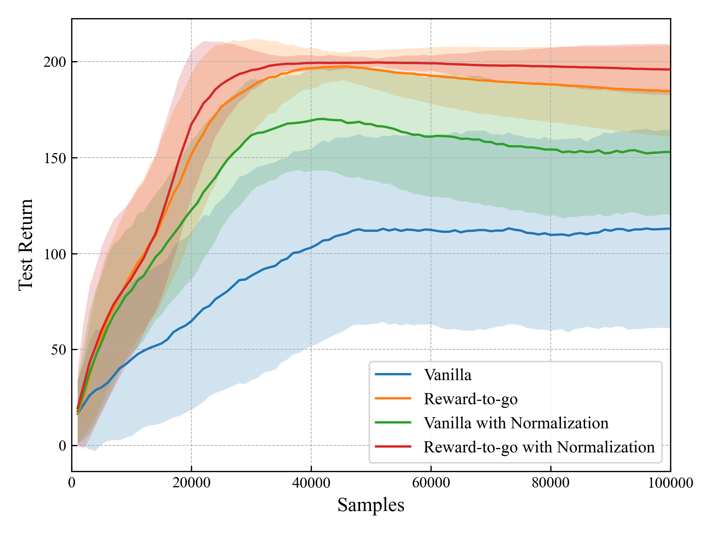
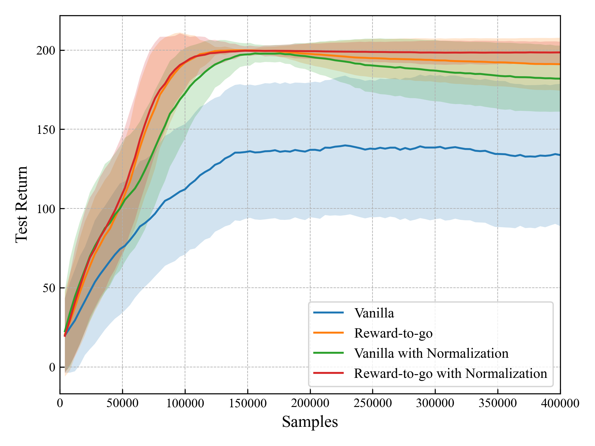

# Experiments

## Policy Gradients
We designed our experiments following [Berkeley CS 285's homework2](https://rail.eecs.berkeley.edu/deeprlcourse/deeprlcourse/static/homeworks/hw2.pdf) to investigate the following questions:
1. Which value estimator has better performance without advantage normalization: the trajectorycentric one, or the one using reward-to-go?
2. Did the batch size make an impact?
3. Did advantage normalization help?

To explore these questions, we conducted classic control experiments using the Cartpole task, which features a 2D action space and a 4D observation space. The objective is to keep the pole upright for as long as possible, where a reward of +1 is given for each step taken, including the termination step, with a success threshold set at 200 rewards.

To address question (1), we compared the performance of the Vanilla Policy Gradient (VPG) and the Reward-to-Go Policy Gradient (RTG) with batch size of 100. For question (2), we experimented with an increased batch size of 400 to observe its impact. Regarding question (3), we conducted a experiment with both batch size to compare the effects with and without advantage normalization. The detailed configurations of these experiments are outlined in the accompanying YAML file.

```yaml
agent_name: "VanillaPG" # Choose the agent type: Vanilla Policy Gradient("VanillaPG") or Reward-to-Go Policy Gradient("RtgPG")

model:
  actor_net: "fc_1layers_32units" # Defines the actor network architecture: 1 fully connected layer with 32 units
  actor_init_output_scale: 0.01 # Initial scaling factor for the output of the actor network
  actor_std_type: "FIXED" # Type of standard deviation used in policy (fixed or adaptive)
  action_std: 0.2 # Standard deviation of actions, relevant for exploration

discount: 0.95 # Discount factor for future rewards
steps_per_iter: 1000 # Number of steps to run per iteration
iters_per_output: 1 # Frequency of output per iteration
test_episodes: 32 # Number of episodes to test the agent

actor_learning_rate: 5e-3 # Learning rate for the actor network

batch_size: 100 # Size of the batch used in training (changed from 100 to 400)
norm: False # Indicates whether to use normalization or not
norm_Q_clip: 1.0 # Clipping value for normalized Q values, if normalization is used
action_bound_weight: 0 # Weight for action bounding, relevant for constrained action spaces
```

```bash
poetry run python run.py --mode train \
--env_config cfg/envs/classic_cartpole.yaml \
--agent_config  cfg/agents/your_config_file.yaml \ # Replace 'your_config_file.yaml' with the name of your actual agent configuration file.
--log_file output/log.txt \
--out_model_file output/model.pt \
--max_samples 10000 # Change max_samples from 10000 to 40000 when batch_size is set to 400.
```

1. **Performance of Value Estimators**: In our experiments, the Reward-to-Go (RTG) value estimator demonstrated superior performance compared to the trajectory-centric method, particularly in scenarios without advantage normalization. This was consistently observed across different batch sizes, where RTG displayed higher scores and a more stable learning curve.

2. **Impact of Batch Size**: We noted a significant improvement in learning outcomes with an increase in batch size. Vanilla Policy Gradient (VPG) model's learning curve, initially converging around a score of 100 with a batch size of 100, improved to converge near 150 when the batch size was increased to 400, indicating the effectiveness of larger batch sizes in learning.

3. **Effectiveness of Advantage Normalization**: The implementation of advantage normalization markedly enhanced the performance, particularly for the Vanilla model, which achieved scores above 150. With a batch size of 400 and normalization, results approached a reward of nearly 200. The minor improvements seen in the RTG model with normalization suggest that the task's simplicity might have limited the observable benefits of this technique.

| Cartpole Task with Batch Size 100 | Cartpole Task with Batch Size 400 |
|:----------------------------------:|:----------------------------------:|
|  |  |
